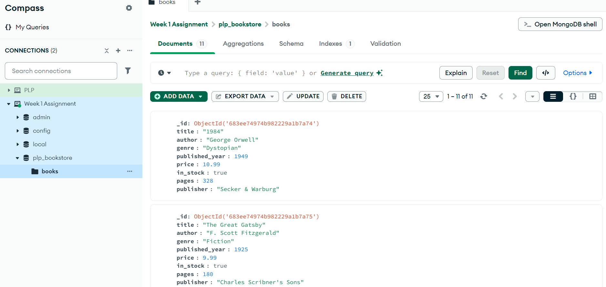

# MongoDB Fundamentals Assignment

This assignment focuses on learning MongoDB fundamentals including setup, CRUD operations, advanced queries, aggregation pipelines, and indexing.

## Requirements

- Node.js (v18 or higher)
- MongoDB (local installation or Atlas account)
- MongoDB Shell (mongosh) or MongoDB Compass

## Getting Started
1. Clone this repository 
2. Install MongoDB locally or set up a MongoDB Atlas account
3. Open MongoDB Shell
4. Run the provided `queries.js` script to populate your database

## Submission

